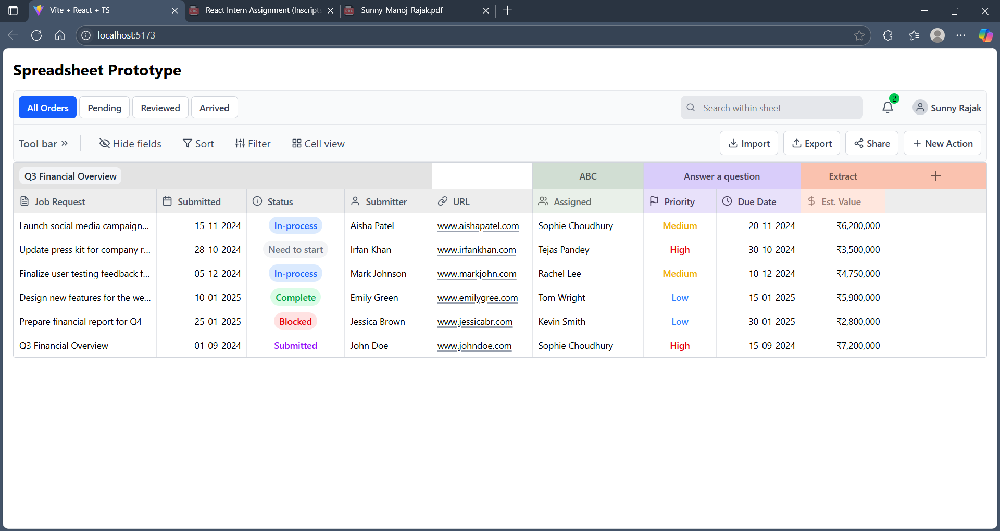

# React Spreadsheet Prototype

This is a **static front-end React prototype** built for the React Developer Internship assignment.  
It replicates the spreadsheet view shared in the Figma design.

---

## 🚀 Features Implemented

✅ Spreadsheet-style table with:

-   Job Request, Submitter, Status, URL, Assigned, Priority, Due Date, Est. Value columns
-   Color-coded statuses and priorities
-   Row selection highlight
-   Header icons

✅ Toolbar with:

-   Tabs ("All Orders", "Pending", "Reviewed", "Arrived") that change active state
-   Left and right action buttons logging to console
-   Search input (logs search text)
-   Notification bell with indicator
-   User profile display

✅ Responsive design for mobile and desktop

✅ All buttons and tabs have working click handlers (no dead UI)

---

## ⚠️ What Is Not Implemented

❌ No real API integration (data is static)

❌ No persistent state (all data is in memory)

❌ No authentication (user profile is static)

---

## 🛠 How to Run Locally

1.  **Clone the repository:**

    ```bash
    git clone https://github.com/YOUR_USERNAME/react-spreadsheet-prototype.git
    cd react-spreadsheet-prototype
    ```

2.  **Install dependencies:**

    ```bash
    npm install
    ```

3.  **Start the development server:**

    ```bash
    npm run dev
    ```

4.  **Open your browser:**

    ```bash
    http://localhost:5173
    ```

---

## ✅ Linting & Type Checking

To ensure code quality, run:

```bash
npm run lint
npm run type-check


Both commands should complete without errors.

---

## 📷 Screenshots


```
